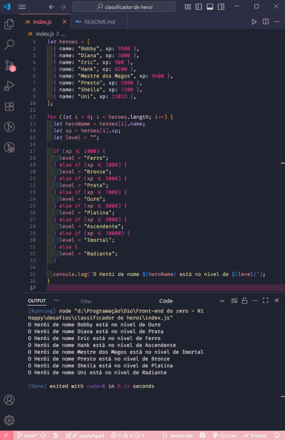

# Classificador de Nível de Herói

## 🧠 Desafio
 
 Criar um **Classificador de Nível de Herói** utilizando uma variável para armazenar o nome e a quantidade de experiência (XP) de cada herói, depois utilizar uma estrutura de decisão para apresentar a mensagem de saída abaixo:

**"O Herói de nome** ```{nome}``` **está no nível de** ```{nivel}```**"**


## ⚒️ O que deve ser utilizado

- Variáveis
- Operadores
- Laços de repetição
- Estruturas de decisões

## 🧮 Regras de classificação 
- XP menor do que 1.000 = Ferro
- XP entre 1.001 e 2.000 = Bronze
- XP entre 2.001 e 5.000 = Prata
- XP entre 5.001 e 7.000 = Ouro
- XP entre 7.001 e 8.000 = Platina
- XP entre 8.001 e 9.000 = Ascendente
- XP entre 9.001 e 10.000= Imortal
- XP maior ou igual a 10.001 = Radiante

## 🖼️ Resultado


